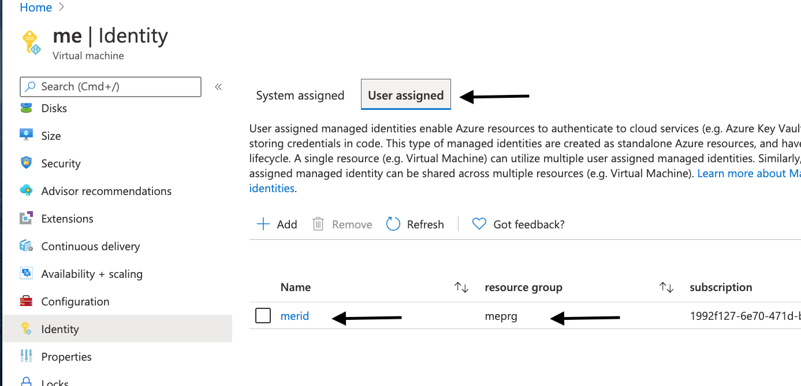
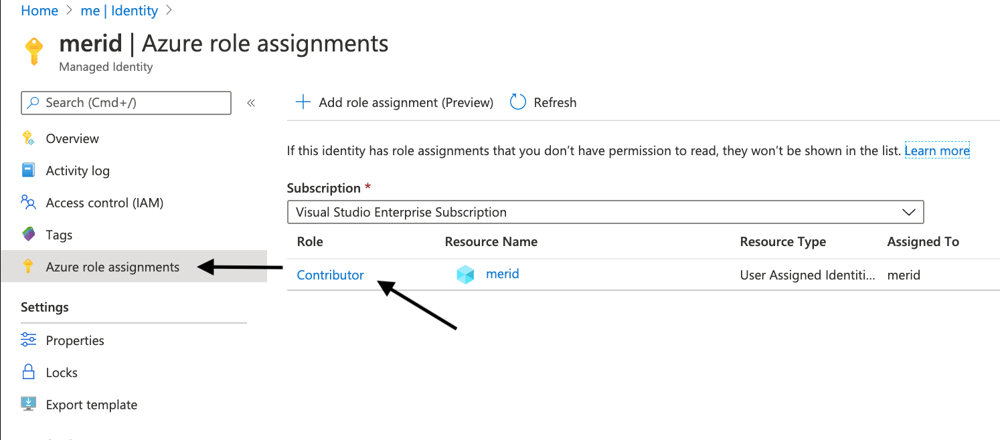
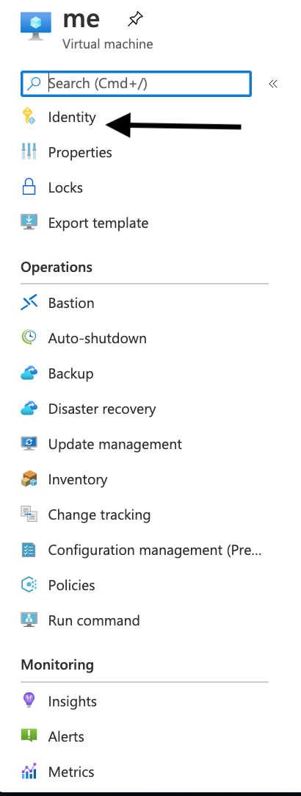
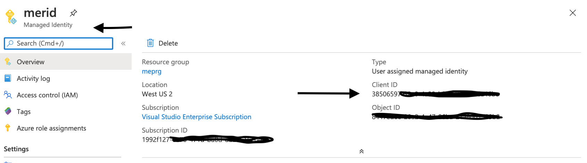

# Using GO Keyvault SDK with Managed identities

In order to run examples/go-keyvault-msi-example.go, follow these steps:
- Create a keyvaul and a secret
- Create a managed identity
- Set the environment variables
- go run examples/go-keyvault-msi-example.go 

## Create a vault and a secret
- Logon to the azure portal in to your subscription and create an user assigned managed id.
- Create a vault, a secret and set a value for that secret
- Take a note of the keyvault name and set the **KVAULT_NAME** environment variable.
- Take a note of the secret name and set the **KVAULT_SECRET_NAME** environment variable.

## Create a managed identity 
- Logon to the azure portal in to your subscription and create an user assigned managed id.

- Assign a contributor role to the managed identity.

- Assign managed id to VM.

- Copy client ID and assign is to the environment **AZURE_CLIENT_ID** variable.


## Set the environment variables
```code
AZURE_TENANT_ID: Your Azure tenant ID
AZURE_CLIENT_ID: Your Azure client ID. This will be an app ID from your AAD.
KVAULT_NAME: The name of your vault (just the name, not the full URL/path)
KVAULT_SECRET_NAME to the secret's name.
**Important note:** Do NOT set AZURE_CLIENT_SECRET. This example uses Managed identities.
```

## Run examples/go-keyvault-msi-example.go
On your terminal where you have the environment variables set:

```code
$cd ~/go/src/azure-sdk-for-go-samples/keyvault/examples
$go run go-keyvault-msi-example.go
KVAULT_NAME: mekv01

Listing secret names in keyvault:
string
mesecret

newsecret
KVAULT_SECRET_NAME: mesecret
KVAULT_SECRET Value: mesecretvalue
Setting 'newsecret' to 'newvalue'
added/updated: https://mekv01.vault.azure.net/secrets/newsecret/13cd55828aaf40e990b970c3c4cd07cf

Listing secret names in keyvault:
string
mesecret

newsecret
```
